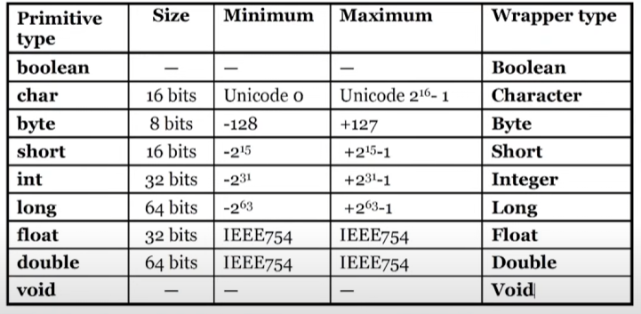
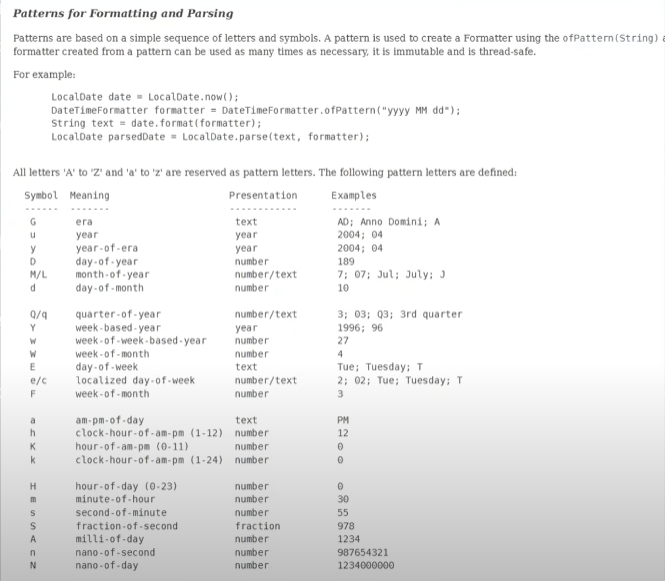

# ☕️ Java Lessons - Fun and Practical! 🚀

Hi! I'm **Xjectro** 👋

In this repo, you'll find Java programming lessons from beginner to advanced, with fun examples! Each topic has its own folder, lots of code samples, and clear explanations.

## 📚 Contents

- Variables, Operators, Conditionals
- Loops (for, while, do-while)
- Arrays and ArrayLists
- Classes, Object-Oriented Programming (OOP)
- Inheritance, Polymorphism, Abstraction, Interface
- File Reading/Writing
- Exception Handling
- Date & Time operations
- And much more!

You can find Java code and explanations for each topic in its folder. Run the code on your computer and practice!

## 🚦 How to Use?

1. Download or clone the repo:
   ```bash
   git clone https://github.com/Xjectro/java-lessons.git
   ```
2. Go to the topic folder and open `src/Main.java` to run.
3. Feel free to add your own experiments!

## 🤩 Contribute

- Report issues or missing parts via issues.
- Want to add new examples or explanations? Send a pull request!

## 📸 Images

Some topics include images:




## 📎 License

This project is licensed under [GPL v3](LICENSE).

---

> Learning Java has never been this fun! 🎉

---

**GitHub:** [Xjectro](https://github.com/Xjectro)  
**Repo:** [java-lessons](https://github.com/Xjectro/java-lessons)
